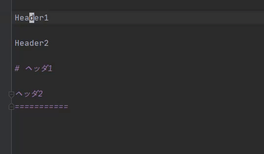

Markowl
=======

Markdown extended plugin for JetBrains IDEs and owl🦉


Features
--------

| Action            | Demo                                  | Default Shortcut |
| ----------------- | ------------------------------------- | ---------------- |
| Format Table      |      | `Alt + ;`        |
| Draw H1 Line      |  | `Alt + -`        |
| Draw H2 Line      |  | `Alt + =`        |

Support encodings

* UTF-8
* SJIS


For developers
--------------

### Run on development instance

```console
gradle runIde
```

### Build distribution

```console
gradle buildPlugin
```

### Release

- [ ] Update `plugin.xml` (OPTIONAL)
- [ ] Update `build.gradle`
    - [ ] changeNotes
- [ ] make release version=x.y.z
- [ ] Upload `build/distributions/markowl-${version}.zip` to [JetBrains market]

[JetBrains market]: https://plugins.jetbrains.com/plugin/edit?pluginId=14116
