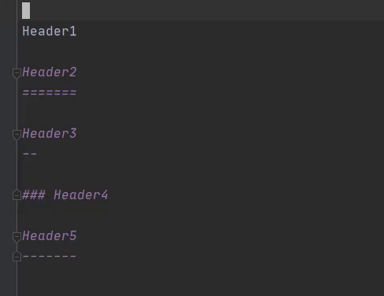

Markowl
=======

Markdown extended plugin for JetBrains IDEs and owl🦉


<script defer src="https://plugins.jetbrains.com/assets/scripts/mp-widget.js"></script>


Features
--------

Support encodings

* UTF-8
* SJIS


### Format Table


| Action         | Default shortcut key |
| -------------- | -------------------- |
| Format Table   | `Alt + ;`            |


### Draw Header Line


| Action       | Default shortcut key |
| ------------ | -------------------- |
| Draw H1 Line | `Alt + -`            |
| Draw H2 Line | `Alt + =`            |


### Draw Header Prefix



| Action         | Default shortcut key |
| -------------- | -------------------- |
| Draw H1 Prefix | `Alt + 1`            |
| Draw H2 Prefix | `Alt + 2`            |
| Draw H3 Prefix | `Alt + 3`            |
| Draw H4 Prefix | `Alt + 4`            |
| Draw H5 Prefix | `Alt + 5`            |


For developers
--------------

### Run on development instance

```console
gradle runIde
```

### Build distribution

```console
gradle buildPlugin
```

### Release

- [ ] Update `plugin.xml` and commit (OPTIONAL)
- [ ] Update `build.gradle`
    - [ ] changeNotes
- [ ] make release version=x.y.z
- [ ] Upload `build/distributions/markowl-${version}.zip` to [JetBrains market]

[JetBrains market]: https://plugins.jetbrains.com/plugin/edit?pluginId=14116
